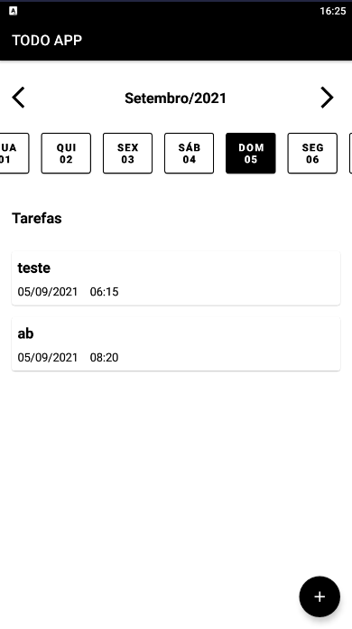
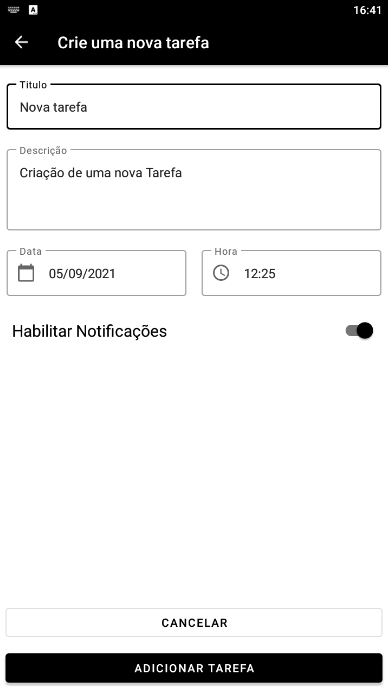
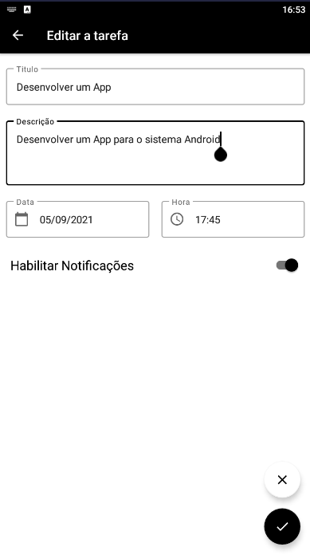
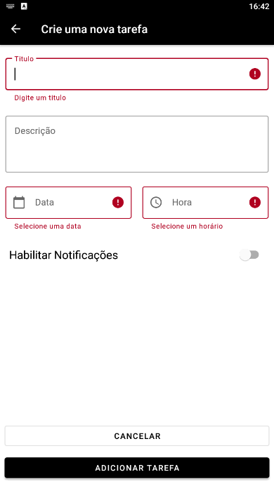
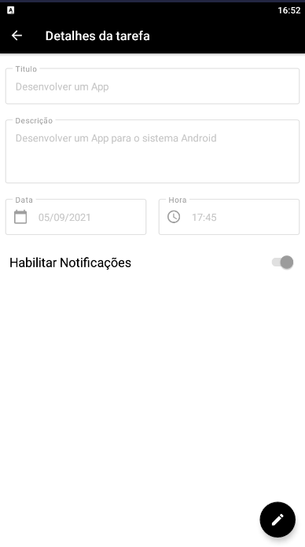
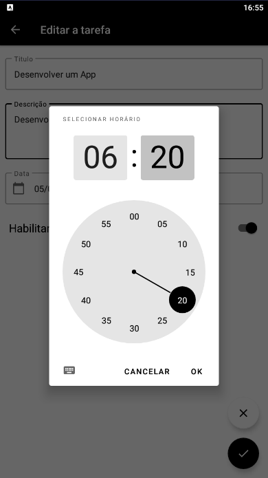

# To-Do List App

Este repositório é a minha solução para o desafio final do Santander Bootcamp | Mobile Developer da [Digital Inovation One](https://digitalinnovation.one).

|  |  |  |
| ---------------------------------------------- | -------------------------------------------- | ------------------------------------------- |

## 🎌 Objetivos

- Aplicar os conhecimentos obtidos no Bootcamp.

## 🛠 Tecnologias

As seguintes ferramentas foram usadas na construção do projeto:

- [Android Studio](https://developer.android.com/studio)
  - Room
  - Coroutines
  - Navigation graph
  - Unit Tests
  - ViewModel

## 📱 Telas do App

### **Tela inicial**

|  |  |  |
| ---------------------------------------------- | -------------------------------------------- | ------------------------------------------- |

### Tela de criação de Tarefas

|  |  |  |
| ---------------------------------------------- | -------------------------------------------- | ------------------------------------------- |

### Tela de detalhes e edição de Tarefas

|  |  |  |
| ---------------------------------------------- | -------------------------------------------- | ------------------------------------------- |

### Time and Date Pickers

|  |  |  |
| ---------------------------------------------- | -------------------------------------------- | ------------------------------------------- |

## ✨ Pré-requisitos

Antes de começar, você vai precisar ter instalado em sua máquina as seguintes ferramentas:
[Git](https://git-scm.com) e o [Android Studio](https://developer.android.com/studio) devidamente configurados.

## 🚀 Getting Started

- Clone este repositório.
```
git clone https://github.com/gabriwill/TODO-android-kotlin-app.git
```
- Execute o arquivo `build.gradle`.

## :octocat: Autor

Feito com 👨🏻‍💻 por Gabriel Willans 

👋🏽 Entre em contato!

[](https://www.linkedin.com/in/gabriel-willans-780754200/) [](mailto:g.willans@outlook.com)
